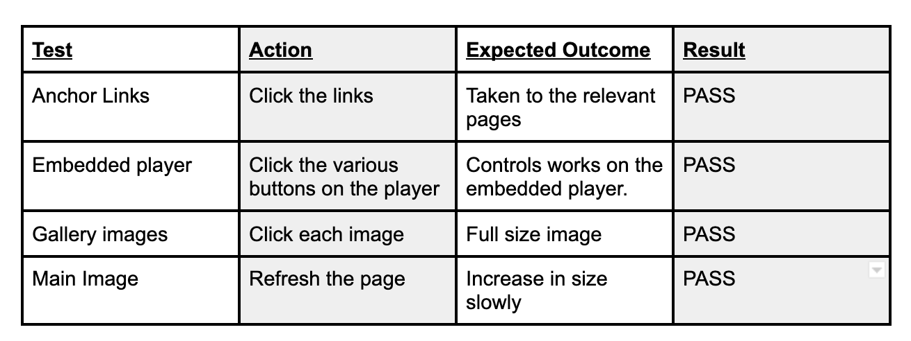

# Milestone Project 1: Code Institute
### djslenderuk.co.uk - Website

## Description
---
In my first milestone project on the code institute full stack development course, I aim to create a responsive, mobile first approach website, using the HTML and CSS and bootstrap that I have learnt so far from this course. I have used CSS frameworks, Bootstrap and will credit them for the use of there styling. I unfortunately didn't speak with my mentor regarding the website I was going to design as, due to already having an idea from previous projects in particular the running club. It would've potentially saved me some time with the incredible ideas and knowledge and understanding he has about web design, if we ran through the ideas I had first with him. The scope of the project does not include any back-end functionality, it is solely meant to be a landing page with information only, so whilst there is an enquiries page, information entered into the fields will not feed anywhere.
I chose to work on my webpage as my first project as I liked the idea of creating something unique and representative of me. I am a DJ in my spare time. So this made it easy for me to begin my project and allow people to hear my mixes (and my mixing ability) and ascertain what it would be like if they were to hire me for their event. To follow me on social media and to get a little bit of a background on me, hopefully all the information provided would entice them to contact me on my enquiries page.

[My Website](djslender.co.uk)

## UX
---

My aim was to develop a sleek and simple design that would incorporate my character and minimalist style. I wanted my main page to represent me with two images, a brief overview of myself along with mixes from my mix page. The first image that is displayed would represent the slogan which is ‘bringing music to life’ and allows the image to come towards the user upon entering the page. Below that would be a narrative of what users would gain from the site and the different pages available to click on to the relevant sections. The final section on the landing page displayed mixes. The aim of the page was to allow users to make an informed decision as a hiring person which could also allow access to those who simply wanted to browse and were able to click on the relevant sections. At the footer of the page I included icons from the fontawesome site and links to my social media, which I have included on all my pages (my pages as a navbar from bootstrap).

The ‘about’ page is a biography page which details my personal profile such as, how I became a DJ and my passion. When I created the page I was conscious that it was not interpreted as a large section of paragraphed text. I wanted to include something creative, I had a vision for it but didn't know what it was called or where to look for it. My style on this page was influenced by Rueben (my mentor with code institute) who pointed me in the right direction of parallax designs. The idea was to break up the text with images. Having said this, I did not want the images to look out of place or be the main focus of the page. So using [w3school](www.w3school.com) I was able to learn how to develop the page so that it had a dynamic feel. So now the text is broken up with images that separate each paragraph with a phrase said from the biography as a quoted heading.

I created a gallery page to give users a view as to what my dj ‘setup’ looks like, the different events I have dj'd at, and some of the artists that I have worked alongside. I was unaware of the different things that could be done with this page until it was highlighted to me by Rueben allowing me to focus on more than the css hover styling. I decided to look at creating a page where the image becomes full screen rather than just the thumbnail that I chose to display the images on. I included modal and carousel but unfortunately the carousel was not working the way I wanted it to work so I opted for just the modal.
The mixes page was effortless to create. The point of this page was to allow users to come to this page and have a listen to the varied genres of mixes and the different styles of mixes. This page I embed a number of mixes from [soundcloud](www.soundcloud.com) that would demonstrate the different types of music that I play. I choose to divide the sections to make it easier for the user to see what sort of music groups there were within each subheading. I later added color to every other section to break it up further and add creativity whilst maintaining the theme of the site.

The enquiries page is in my opinion the most simplistic page on my site. This page allows users to contact me with various queries regarding mixes and or hiring me for their event. A contact form, where they would provide their information such as full name, email and details of their enquiry once they selected the relevant radio button. The contact Similarly with the About page would be split into two columns at desktop level, and one column at mobile level. The first column would contain a picture of myself and the second column would be where I would provide text.

I wanted to ensure the navigation remained in the same place where possible (it would fall into a collapsible button at mobile level). I chose to use oswald and lato as my fonts because I saw how well the font looked when working through the running club exercise-module. I wanted the font to be impactful with a header but at the same time not be viewed as too corporate. In my opinion the greyscale has a good variety of shades and would look excellent against the white background which would allow it to look very neutral and stylish at the same time.

I used wireframes to help me decide how I was going to design my website, below are links to my wireframes images. I generally stuck to my wireframes with slight amendments but overall I stuck to my wireframes. The design changed as the project progressed following discussions with Rueben, my mentor.
 

[Home wireframe](README.files/slender_wireframes/home_wireframe)

[About wireframe](README.files/slender_wireframes/about_wireframe)

[Event wireframe](README.files/slender_wireframes/event_wireframe)

[Gallery wireframe](README.files/slender_wireframes/gallery_wireframe)

[Mixes wireframe](README.files/slender_wireframes/mixes_wireframe)

[Enquiries wireframe](README.files/slender_wireframes/enquiries_wireframe)

## Features
---
#### Current Features
* Home - A brief overview of the site and its features.
* About - Some insight in to me as a DJ.
* Events - Events I will be DJing at.
* Gallery - A view of me in different enviroments, also with various musical artists, which opens into full sizes images when clicked.
* Mixes - A variety of mixes, showcasing the varied styles of mixes and genres.
* Enquiries - A form which allows users to make enquires or book me for an event.

#### Future Features
* Events - A page which details the upcoming events that are in my calendar.
* Social Media - A social media feed of my latest posts. 
* Live Feed - Live streaming radio or social media (youtube, twitch, zoom, instagram)

## Technologies/Support Used
---
Below is a list of technologies I have used to create my website.
* HTML - HTML5 provided the content and the structure of my website. I tried to use semantic elements where possible to ensure the best structure.
* CSS - CSS was used to style my pages.
* [Bootstrap](https://getbootstrap.com/) - Bootstrap was an amazing framework to use as it saved on code writing and help me with the layout of my website. I used the Nav bar the enquiries form and the modal. I used Bootstrap to assist in building a Mobile-first approach website.
* [FreeFormatter](https://www.freeformatter.com/html-formatter.html#ad-outputm) - This is my text editor. To validate code and to correct the format.
* [Git](https://git-scm.com) - Git was used for version control. Allowing me to create backups whenever significant changes were made to my code.
* [GitHub](https://github.com/) - This is where my repository is held externally. I aslo used GitHub pages to deploy my website to link to my domain.
* [Javascript/JQuery](https://jquery.com/) - This was imported via the Bootstrap framework to enable me to create a responsive collapsible nav bar at smaller screen sizes.
* [Google Fonts](https://fonts.google.com/) - Used to import specific fonts I wanted to use on my website.
* [Font Awesome](https://fontawesome.com/) - Used website to impor icons for my social links.
* [Google Domains](https://domains.google.com/) - To link my domain to the git hub pages ip address.
* [Adobe Color](https://color.adobe.com/create/color-wheel) - Color palette creator, used throughout my site.
* [favicons](https://www.favicon.cc/) - Used to include in my header title.

## Testing
---

Before creating my website I created a table for things I thought I needed to test. Throught every stage I checked to see if they remained working.

I also continuously tested my website throughout my project on a desktop and using my mobile. I used the web developer tools consistently to ensure my website was responsive, firstly at mobile screen sizes, and then at larger screen sizes. I used the device feature in the dev tools to test the build on all devices available.
The automatic checks of my HTML and CSS structure were done in [W3C Validator](https://validator.w3.org/#validate_by_input) to ensure there were no errors and they were both structured correctly. I repeated this process throughout the project. To ensure that my website was responsive across different browsers, I sent the link to my friends and family to identify any site problems. When image issues were identified I cross referenced this with others and found that not everyone experienced problems on their browsers. I then thought it was an issue with ‘github’ so i published the page which did not solve the issue which made me think it was a safari issue, however, that did not resolve the problem either. I struggled to solve that issue but using various problem solving exercises I hoped I would arrive at the issue. I'm under the impression it is a dated device software issue. My default browser is Google Chrome, I also tested the build on Safari, Firefox, IE, Edge and Opera, although these were done periodically. Currently, the website functions exactly as it should on all browsers.

Problem solving issues originally proved to be very difficult, the more I worked with Reuben the more clarity I had. If there was an error on my page I explored how I would identify the problem and where to go to locate the issue, using dev tools and making the changes in Git. I gained more confidence working closely with Reuben and it became easier to identify how to check the difference styles, how things would be presented if I changed things around or added color for example. Paying attention to the problems section in git allowed me to identify when there were tag issues.

**Feedback**
Tiana - "Great website to maniouver around, as somebody that is not IT literate and it is a very simple and straight forward website to use."
Shareen - "Booking and upcoming events is very simple and not complex to get to or to fill out the form. Maybe a little more variety in the enquiries section or more regarding what i can achieve in this section."
Elaine - "Love the colors and how clear it is."
Ryan - "A nice website."
Joshua - "Good website, however I would prefer options to live events, more social media interaction"

Overall, the feeback was helpful as they all stated the website was simple and straight forward to use. It has room for improvement in regards to social media.

## Bugs
---

There was not an issue that I did not encounter throughout the whole project. The most memorable were very simple fixes such as closing tags. Other issues i had was .col-6-xs it wasnt working how i envisioned until i spoke with a tutor (Tim) who directed me to Anna's bootstrap grid layout explanation on youtube (I unfortunately can not find the link now, will insert later). I realised that I was working backwards. Bootstrap starts with small screens first then to large. so had to change it to .col-4-lg. The other issue was the z-index not being included in the navbar to stop the image from covering the navbar. .navbar-light .navbar-brand was not picking up the color so i had to use !important.

I also had an issue with the carousel inside the modal it was not proceeding forward or backwards when the icon next or previous was clicked, I checked the js, which made no difference when removing doing various changes, I checked on stack overflow and asked tutors/ mentors but solutions were provided. I also had one issue with one user not being able to view the images on the ‘about page’ . I unfortunately have not been able to resolve this.

## Deployment
---

This site is hosted using GitHub pages, deployed directly from the master branch. The deployed site will update automatically upon new commits to the master branch. In order for the site to deploy correctly on GitHub pages, the landing page must be named index.html. I have a domain name, which I have linked through the domain dns.

To deploy the website to GitHub pages, I followed the below steps:
* Selected the milestone-project-1 from my GitHub dashboard.
* Selected 'Settings' from the menu bar.
* From the GitHub pages section, I chose 'master branch' from the dropdown menu.
* Once selected, the page refreshed and a link was displayed in the GitHub pages section to my wesbite.
* I entered a custom url as I previous bought a domain djslender.co.uk.
* [Website Link](https://djslender.co.uk)

### To run this project locally

* Follow this link to the [GitHub Repositiry](https://github.com/slendz/djslenderuk.co.uk)
* Click on the 'Clone or Download' button.
* Copy the URL provided.
* Open a bash terminal, move to your desired directory.
* Type 'git clone' and paste in the URL.

## Credits
---
* To the multiple Code Institute tutors (Tim, Stephen, Anna, Michael Hayley, Igor, Cormac and the infamous RoboDuck), constantly there to help me to think more for myself and out of the box more pointing in some of the right direction, which absolutely helps me more with the right skills to problem solve independently.
* To my mentor, [Reuben Ferrante](https://github.com/arex18), for guiding me through the process and offering assistance when necessary to point me in the right direction, also, come up with some really cool suggestions.
* [Balsamiq](https://balsamiq.com/) - Used to build out wireframes for my website.
* [W3C Validator](https://validator.w3.org/#validate_by_input) - A validator used to check my HTML and CSS structure and format periodically throughout the build.
* [W3Schools](https://www.w3schools.com/) - I used this to ensure I was entering all the information required correctly in my HTML and CSS as well as creating my parallax.
* Hayley Schafer - readme.md was a great guide, helped me to structure my read.me better
* Jaime Boyd - readme.md was also a great guide with how indepth the information needs to be in the readme file.
* To the code institue mini project - Running Club, massively inspired by this, with some adaptations and using bootstrap.

#### Copied Code
As stated in the technologies used section, I used various websites to import animations and fonts etc. However, I explicitly copied code from Bootstrap for my Nav Bar and the modal for the Gallery page, parallax for the about page from teh w3school page.

